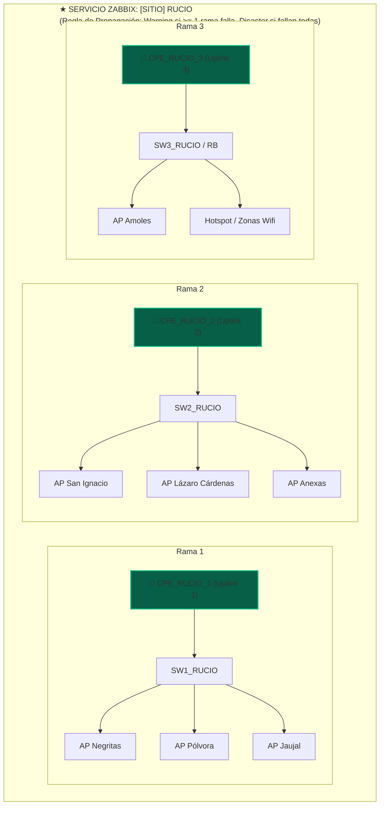

# 📡 Análisis y Especificación: Jerarquía de Zabbix Services (BSM) y Topología NexusDude

> **Fecha:** 18 de Septiembre de 2026  
> **Proyectos:** Nexus Orchestrator & NexusDude  
> **Objetivo:** Definición de reglas para evitar jerarquías redundantes/cíclicas en Zabbix Services, modelar alimentación real por Antena/Fibra Óptica (Nodo Padre de Sitio), y resolver arquitecturas multi-enlace (ej. Torre RUCIO).

---

## 1. Contexto y Diagnóstico del Problema

En la integración de topologías de red en el lienzo interactivo de **NexusDude** con el motor de monitoreo de servicios de negocio **Zabbix Services (BSM)** de **Zabbix 7.0**, se identificaron las siguientes discrepancias en el comportamiento de propagación de fallas y relaciones padre-hijo:

### 1.1. Nodos de Retorno y Jerarquías Cíclicas / Redundantes
- **Comportamiento Actual:**
  - En un mapa padre (ej. `HUIZACHE`), se convierte un equipo emisor (ej. `AP_CHANCAQUERO`) en un nodo tipo `submap` apuntando a `CHANCAQUERO`.
  - Dentro del submapa `CHANCAQUERO`, el operador convierte el equipo receptor (`CPE_CHANCAQUERO`) en otro `submap` apuntando hacia `HUIZACHE` para poder regresar al mapa padre con doble clic.
- **Impacto Negativo:**
  1. **Pérdida del host en Zabbix:** Al mutar `device_type = 'submap'`, el backend omite la creación del servicio de host y sus triggers de ping, dejando a los equipos físicos reales sin monitoreo de servicio individual.
  2. **Ciclo Prohibido en BSM:** Zabbix Services exige una estructura de **Grafo Acíclico Dirigido (DAG)**. Si dos mapas o nodos se apuntan mutuamente como dependencias, se genera un bucle de estado que distorsiona la causa raíz (*Root Cause Analysis*) y el cálculo de SLAs.

### 1.2. Inversión de Causa Raíz (Alimentación por Antena o Fibra Óptica)
- **Comportamiento Actual:**
  - El archivo `zabbix_service.py` clasifica jerarquías mediante una tabla estática `ROLE_RANKS`:
    - `core`: 1, `router`: 2, `olt`: 3, `switch`: 4, `ap`: 5, `antenna / cpe`: 6.
- **Impacto Negativo en Sitios Reales:**
  - En estaciones repetidoras o sitios rurales, la **alimentación principal del sitio** entra a través de una **Antena CPE / Radioenlace PTP** o una **ONT / Enlace de Fibra Óptica (FO)**, la cual se conecta a un Switch local.
  - Al tener la antena un rango inferior (`rank 6`) al switch (`rank 4`), el algoritmo infiere erróneamente que el switch alimenta a la antena.
  - Si la antena cae por desalineación o corte de RF, todo el sitio cae; sin embargo, Zabbix culparía al switch o generaría tormentas de alertas en paralelo sin marcar la antena como la causa raíz única.

### 1.3. Torres con Múltiples Enlaces y Switches Segmentados (Caso RUCIO)
- **Topología Identificada:**
  - Desde `HUIZACHE` salen 3 APs (`AP_RUCIO_1`, `AP_RUCIO_2`, `AP_RUCIO_3`).
  - En la torre `RUCIO` reciben 3 CPEs (`CPE_RUCIO_1`, `CPE_RUCIO_2`, `CPE_RUCIO_3`).
  - Cada CPE está conectado físicamente a su propio Switch (`SW1_RUCIO`, `SW2_RUCIO`, etc.), y cada switch distribuye a grupos distintos de sectores y APs locales.
- **Riesgo:** Si no se modelan como **Ramas Independientes (Silos)** o **Grupos de Redundancia**, la caída de un solo enlace pondría en falso estado de caída total a toda la torre.

---

## 2. Nuevas Reglas de Arquitectura

```mermaid
flowchart TD
    subgraph Padre["MAPA PADRE (Ej: HUIZACHE)"]
        SW_H["Switch Distribución Huizache"] --> AP_PTP["AP Emisor PTP (Dispositivo Físico)<br/>[Metadato: target_map_id = CHANCAQUERO]"]
    end

    subgraph Enlace["Troncal Inalámbrica / Fibra Óptica"]
        AP_PTP -.->|"Alimentación de Servicio"| CPE_INGRESS["CPE Receptora (Dispositivo Físico)<br/>[★ NODO PADRE / GATEWAY DE SITIO]"]
    end

    subgraph Hijo["SUBMAPA HIJO (Ej: CHANCAQUERO)"]
        NAV_PORTAL["🔙 Volver a HUIZACHE<br/>[device_type: 'parent_link' | EXCLUIDO DE ZABBIX]"] ~~~ CPE_INGRESS
        CPE_INGRESS -->|"Arista de Alimentación (Física)"| SW_HIJO["Switch del Sitio (SW1)"]
        SW_HIJO --> AP1["Sector 1"]
        SW_HIJO --> AP2["Sector 2"]
        SW_HIJO --> AP3["Sector 3"]
    end

    classDef ingress fill:#065f46,stroke:#10b981,stroke-width:2px;
    classDef portal fill:#3b0764,stroke:#a855f7,stroke-width:2px;
    class CPE_INGRESS ingress;
    class NAV_PORTAL portal;
```

### Regla 1: Clasificación Estricta de Nodos
1. **Dispositivos Físicos con Enlace a Submapa (`has_map_link = true`):**
   - Conservan su `device_type` real (`Access Point`, `CPE`, `SWITCH`, `Router`), su IP y su `device_id`.
   - Generan un servicio de host en Zabbix con sus problem tags correspondientes.
   - En el lienzo se dibuja un icono o badge `↗ Abrir Submapa`.
2. **Portales de Retorno / Enlaces de Navegación (`device_type = 'parent_link'` o `'nav_link'`):**
   - Elementos visuales en el lienzo con icono `🔙 Volver al Mapa Padre`.
   - **Exclusión total de Zabbix Services:** El sincronizador omite estos nodos en `service.create` y no genera dependencias hacia ellos, eliminando cualquier posibilidad de bucle.
3. **Contenedores de Sitio Puro (`device_type = 'submap'` sin IP):**
   - Se crean como carpetas organizativas para sitios que no tienen un único equipo cabecera.

### Regla 2: Identificación del Nodo Padre / Ingress del Sitio (Antena / FO)
- **Atributos de Entrada:**
  - `is_site_uplink: bool = true`
  - `uplink_feed_type: str ('antenna', 'fiber', 'gateway')`
- **Comportamiento en Topología:**
  - Todo nodo marcado como Ingress tiene automáticamente **Rango 1 (Raíz del Sitio)**, superando el ranking fijo de su tipo de hardware.
  - El servicio de Zabbix del sitio/mapa toma como hijo directo este nodo de alimentación. Si la antena o la fibra falla, el servicio del sitio entra en estado Crítico indicando la causa raíz correcta.

### Regla 3: Clasificación de Aristas
- **Aristas Físicas / Alimentación:** Conectan el nodo de alimentación hacia los switches y APs. Establecen la jerarquía de dependencias en Zabbix Services.
- **Aristas de Navegación:** Si se dibuja una arista hacia un nodo de tipo `parent_link`, se marca como `edge_type = 'navigation'` y se ignora al sincronizar con Zabbix BSM.

---

## 3. Arquitectura para Sitios Multi-Enlace (Caso Torre RUCIO)

Para torres con múltiples enlaces descendentes y switches segmentados, se aplican dos modelos según la operación física:

### Modelo A: Ramas Físicas Independientes (Segmentación de Tráfico)
Cada enlace atiende a un grupo exclusivo de sectores sin interconexión entre switches.

- **Propagación ante Fallas:**
  - Falla en `CPE_RUCIO_1`: La **Rama 1** entra en estado Crítico.
  - Los APs dependientes de `SW1_RUCIO` marcan a `CPE_RUCIO_1` como causa raíz.
  - Las Ramas 2 y 3 continúan operativas en verde.
  - El servicio global `[SITIO] RUCIO` pasa a estado **Warning (Degradación Parcial)**, alertando al NOC sin declarar caída general de la torre.

### Modelo B: Redundancia / Failover Real
Si los switches o routers de la torre están enlazados con OSPF, Bonding o VRRP:
- Los 3 CPEs forman un grupo de servicio de alimentación:
  - **Algoritmo Zabbix:** *Most critical if ALL children have problems*.
  - Si cae 1 CPE: Se genera una advertencia de redundancia perdida, pero el sitio no se declara caído.
  - Si caen los 3 CPEs: Se declara caída total del sitio.

---

## 4. Navegación Contextual Bidireccional (Servicio ➔ Lienzo)

1. **Etiquetado en Zabbix Services:**
   - Cada servicio de nodo incluye las etiquetas:
     - `map_id: <id_mapa>`
     - `node_id: <id_nodo>`
     - `managed_by: nexusdude`
2. **Salto Directo desde la UI:**
   - Soporte para parámetros de hash en la URL:
     `http://10.9.8.52:8085/#map=<map_id>&node=<node_id>`
   - Al cargar o navegar mediante un servicio, el frontend de NexusDude:
     1. Carga el mapa especificado en `map_id`.
     2. Centra el escenario (pan y zoom) sobre las coordenadas `(x, y)` del nodo.
     3. Aplica un efecto visual de resalte (*pulse animation*) durante 3 segundos sobre el nodo causante de la alarma.

---

## 5. Plan de Implementación Técnica

| Módulo | Archivo | Modificaciones Requeridas |
| :--- | :--- | :--- |
| **Modelos** | `app/models.py` | Soporte para `parent_link` en `device_type`, `is_site_uplink: bool`, y `feed_type` en nodos. |
| **Esquema DB** | `app/database.py` | Migración de campos `is_site_uplink`, `feed_type`, y soporte de índices para búsquedas rápidas. |
| **Sincronizador** | `app/services/zabbix_service.py` | Modificar `analyze_topology` para priorizar nodos Ingress, excluir nodos `parent_link`, y crear sub-servicios de rama para torres multi-enlace. |
| **Rutas API** | `app/api/maps_routes.py` | Nuevos endpoints o parámetros para crear nodos de retorno al mapa padre y fijar nodos de alimentación. |
| **Frontend UI** | `app/static/index.html` | Controles en el panel de propiedades para marcar "Nodo Padre / Uplink del Sitio (Antena/FO)" y botón para agregar "Portal de Retorno". |
| **Canvas Konva** | `app/static/js/app.js` | Renderizado distintivo para Ingress Uplink (borde verde/dorado ⚡) y Portales (púrpura 🔙), manejo de deep-linking `#map=&node=`. |
