# 📡 NexusDude v2.0.0 — (Release NEXUSDUDE.2.0)
> **The Modern Network Dude for Nexus Orchestrator, Zabbix 7.0, NetBox & i-WISP**

Plataforma de mapeo, análisis y monitoreo visual de topologías de red en tiempo real estilo *The Dude*, integrada bidireccionalmente con **NetBox (DCIM/IPAM)**, **Zabbix 7.0 (Telemetría, LLD & BSM)**, **i-WISP Manager API** y **OLTs GPON/FTTH (Huawei SmartAX/EA5800 y V-SOL)**.


---

## 🚀 Novedades y Características Principales de NexusDude 2.0

### 1. 🌳 Jerarquía Avanzada y Multi-Acceso a Mapas (`map_hierarchy`)
- **Arquitectura N-a-N de Mapas:** Un mismo mapa o diagrama de infraestructura puede pertenecer y ser accesible desde múltiples mapas padre simultáneamente, permitiendo navegación matricial (ej. acceso por Región y por Anillo de Fibra).
- **Alias Contextuales:** Posibilidad de nombrar un acceso secundario con un alias específico para su contexto (`alias` en la jerarquía) sin alterar el nombre oficial del mapa.
- **Fusión Inteligente de Duplicados (`/api/maps/merge-duplicates`):** Motor automatizado que detecta submapas duplicados con el mismo nombre en diferentes ramas, consolida sus nodos y enlaces en un único mapa canónico y convierte las copias redundantes en accesos múltiples (`map_hierarchy`). Incluye modo simulación (*dry-run*).
- **Reordenamiento Drag & Drop Persistente:** Reorganización manual e intuitiva de mapas y submapas directamente desde el panel lateral, guardando el orden numérico (`position`) en la base de datos en tiempo real.
- **Navegación Dinámica por Breadcrumbs:** Migajas de pan contextuales (`GET /api/maps/{map_id}/breadcrumb`) que reflejan la ruta jerárquica exacta desde el mapa raíz hasta el submapa activo.
- **Retrofitting de Nodos de Navegación:** Creación y actualización automática de nodos interactivos de tipo `submap` en el lienzo del mapa padre (`/api/maps/{map_id}/ensure-parent-node`) para garantizar acceso visual directo con doble clic.

### 2. 🏢 Integración Integral de Sitios NetBox (DCIM como SSOT)
- **Subpestaña de Sitios en Inventario:** Visualizador de todos los sitios registrados en NetBox con filtro de búsqueda instantáneo y semáforo de estatus:
  - 🟢 **Mapeado:** El sitio ya cuenta con un mapa o diagrama vinculado en NexusDude.
  - ⚪ **Sin diagrama:** Sitios pendientes de graficar.
- **Creación de Mapas 1-Clic desde Sitios:**
  - `Crear Mapa desde Sitio`: Asocia automáticamente el `netbox_site_id` y `site_name`.
  - `Crear Mapas Masivos`: Selección múltiple de sitios de NetBox para generar automáticamente su árbol de diagramas.
  - `Poblar / Sincronizar desde Sitio`: Importa al lienzo todos los dispositivos físicos del sitio con sus roles (Router, Switch, OLT, AP), modelos, interfaces y direcciones IP primarias con posicionamiento geométrico inteligente.
- **Sincronización Bidireccional de Cables (`dcim_cable`):**
  - Mapeo automático de conexiones físicas existentes en NetBox hacia enlaces visuales en el lienzo.
  - Flexibilidad operativa: Permite documentar enlaces visuales entre dispositivos sin exigir la selección rígida de interfaces de inmediato, facilitando el diseño rápido y actualización asíncrona.
- **Sincronización Global de Nodos NetBox:** Endpoint `/api/maps/sync-all-netbox-nodes` para refrescar metadatos, IPs y estados de todos los dispositivos del lienzo contra NetBox.

### 3. 🔐 Estandarización de Zabbix 7.0 a API Tokens & SSO Delegado
- **Autenticación Zabbix por API Token:** Estandarización completa de la conexión con Zabbix 7.0 mediante `ZABBIX_TOKEN`, eliminando dependencias obsoletas de usuario y contraseña (`ZABBIX_USER`/`ZABBIX_PASS`) y elevando la seguridad perimetral.
- **SSO Delegado con Nexus Orchestrator:** Autenticación compartida transparente mediante tokens JWT firmados (`NEXUS_JWT_SECRET`), validando permisos centralizados contra `https://10.9.1.6:5001`.

### 4. ⚡ Centro de Diagnóstico Profundo OLT & Clientes FTTH (NOC Suite)
- **Descubrimiento de OLTs:** Detección y auditoría de **24 OLTs** registradas en Zabbix (`/api/zabbix/olt/diagnostic-summary`).
- **Carrusel Interactivo de Puertos GPON:** Selector de tarjetas con conteo de ONTs por puerto (`GPON 0/1/0` a `GPON 0/1/15`).
- **Lectura SNMP Secuencial en Vivo:** Consultas `snmpbulkwalk` optimizadas sin saturación de CPU de controladoras:
  - Serial ONT (`hwGponOntSerialNumber`).
  - Potencia Óptica Rx en dBm (`hwGponOntOpticalInfoRxPower`).
  - Causa Raíz de Desconexión (`hwGponOntLastDownCause`).
- **Detección de Causa Raíz:**
  - ⚡ **Dying-Gasp (Código 1):** Corte de energía en domicilio (fibra íntegra).
  - ✂️ **Corte de Fibra / LOSi (Código 2):** Rotura de cable o caída de caja NAP.
  - 🟡 **Atenuación Óptica Crítica:** Detección de ONUs degradadas ($\le -27.0\text{ dBm}$).
- **Enriquecimiento i-WISP en Tiempo Real:** Cruce instantáneo de serial con N° de Cliente, Nombre y Plan Contratado (`RESIDENCIAL 50M`).
- **Gestión Multi-Comunidad SNMP:** Almacenamiento seguro en `olt_snmp_credentials`, cascada de auto-aprendizaje y edición en caliente `[ 🔑 SNMP ]` desde la interfaz.

### 5. 📖 Centro de Documentación & Manual Operativo Integrado (F1)
- **Visor Técnico In-App:** Acceso instantáneo con la tecla `F1` o mediante el botón `? Manual & Docs` en la barra superior.
- **Contenido Modular Interactivo (`docs.js` & `docs.css`):**
  - Conexión e integración con NetBox, Zabbix e i-WISP.
  - Jerarquía, submapas y fusión de accesos múltiples.
  - Convención de cableado y documentación física vs lógica.
  - Diagnóstico GPON y análisis de causas raíz en NOC.
  - Preguntas frecuentes y atajos de teclado.

### 6. 🎨 Lienzo Konva.js de Alto Desempeño
- **Optimización de Renderizado Reactivo:** Indexación en memoria de enlaces (`_getOrBuildNodeMap`, `registerAttachedLink`) que elimina el lag al arrastrar nodos conectados a múltiples aristas.
- **Soporte para Nodos Especiales:** Dispositivos de red, submapas, notas adhesivas, nubes WAN y brazos FTTH (`ftth_branch`) con semáforo óptico en vivo.

### 7. 🟢 Iluminación Gobernada por Ping & Telemetría Simplificada
- **Gobernanza Visual por ICMP Ping:** La iluminación operativa (verde/rojo) del contorno del nodo (`box.stroke`) y del punto de estado interno (`statusDot.fill`) responde exclusivamente al estado Ping.
- **Enlaces Vinculados al Nodo Destino:** El color del enlace (`getLinkColor`) evalúa directamente la disponibilidad Ping del nodo destino.
- **Limpieza de Tooltips y Propiedades:** Eliminación de gráficos de tráfico e indicadores SNMP no requeridos; visualización enfocada en RTT, pérdida de paquetes y Parámetros RF / Espectro.
- **Intervalo de Sondeo de Zabbix Ajustable:** Selector en configuración (`12s`, `20s`, `30s`, `1m`) para regular el refresco del lienzo y del analizador de espectro RF.

---

## 🏗️ Arquitectura del Sistema

```mermaid
graph TD
    subgraph UI ["Frontend NexusDude 2.0 (HTML5 / Konva.js / ES6)"]
        Canvas["Lienzo Konva.js (Topología, Snap-Grid, Nodos, Cables)"]
        SidebarMaps["Gestor Jerárquico de Mapas (Drag & Drop, Fusión N:M)"]
        SidebarSites["Inventario de Sitios NetBox (Mapeado / Sin Diagrama)"]
        DiagModal["NOC Suite: Diagnóstico OLT & ONTs (Huawei / V-SOL)"]
        DocsModal["Manual Técnico & Guía Operativa Integrada (F1)"]
        ToolbarSync["Menú Sincronización (NetBox, Zabbix BSM, i-WISP)"]
    end

    subgraph Backend ["Backend API (FastAPI / Uvicorn :8085 / :8000)"]
        MapsAPI["/api/maps (CRUD, Jerarquía N:M, Sitios, Breadcrumbs, Fusión)"]
        ZabbixAPI["/api/zabbix (Telemetría, OLT SNMP Bulkwalk, BSM)"]
        InventoryAPI["/api/inventory (NetBox Sitios, Dispositivos, Interfaces, Cables)"]
        ConfigAPI["/api/config (i-WISP API Key, SNMP Communities)"]
        AuthMiddleware["Auth Middleware (SSO Delegado JWT Nexus)"]
        
        ZabbixSvc["zabbix_service.py (Zabbix Token, SNMP Walks)"]
        NetBoxSvc["inventory_service.py (NetBox DCIM REST)"]
        IWispSvc["iwisp_service.py (Caché Clientes, Serial Matcher)"]
    end

    subgraph Database ["Persistencia Local (SQLite WAL Mode)"]
        DB[("nexusdude.db")]
        T_Maps[("maps (id, site_id, position)")]
        T_Hier[("map_hierarchy (parent, child, alias, pos, is_primary)")]
        T_Nodes[("nodes (x, y, ip, role, netbox_id)")]
        T_Links[("links (source, target, cable_id)")]
        T_SNMP[("olt_snmp_credentials (ip, community)")]
        T_IWisp[("iwisp_clients_cache (serial, client_id)")]
        T_Config[("system_config")]
    end

    subgraph Ecosystem ["Ecosistema de Red Externo"]
        NexusOrch["Nexus Orchestrator (:5001 - SSO Central)"]
        NetBox["NetBox DCIM v4.7 (:8443 - SSOT)"]
        Zabbix["Zabbix Server 7.0 (:8082 - API Token)"]
        IWispCloud["i-WISP Cloud Manager API"]
        OLTs["OLTs Huawei SmartAX / EA5800 & V-SOL (SNMP v2c)"]
    end

    Canvas <--> MapsAPI
    SidebarMaps <--> MapsAPI
    SidebarSites <--> MapsAPI
    SidebarSites <--> InventoryAPI
    DiagModal <--> ZabbixAPI
    ToolbarSync <--> ConfigAPI

    MapsAPI <--> T_Maps
    MapsAPI <--> T_Hier
    MapsAPI <--> T_Nodes
    MapsAPI <--> T_Links
    ZabbixAPI <--> T_SNMP
    ConfigAPI <--> T_Config
    ConfigAPI <--> T_IWisp

    MapsAPI --> NetBoxSvc
    InventoryAPI --> NetBoxSvc
    ZabbixAPI --> ZabbixSvc
    ConfigAPI --> IWispSvc

    AuthMiddleware -.-> NexusOrch
    NetBoxSvc <--> NetBox
    ZabbixSvc <--> Zabbix
    ZabbixSvc <--> OLTs
    IWispSvc <--> IWispCloud
```



---

## 🗄️ Esquema de Base de Datos (`data/nexusdude.db`)

| Tabla | Propósito | Índices / Claves |
|---|---|---|
| `maps` | Lienzos y mapas raíz / submapas con metadatos de sitio NetBox | `PRIMARY KEY (id)`, `idx_maps_position`, `idx_maps_netbox_site`, `idx_maps_site_name` |
| `map_hierarchy` | Relaciones jerárquicas N-a-N, accesos múltiples, alias y orden | `PRIMARY KEY (id)`, `FK (child_map_id)`, `FK (parent_map_id)`, `idx_hierarchy_pos` |
| `nodes` | Elementos del lienzo (Dispositivos, Submapas, APs, Notas, Brazos FTTH) | `PRIMARY KEY (id)`, `FK (map_id)` |
| `links` | Aristas lógicas y físicas con vinculación a cables NetBox | `PRIMARY KEY (id)`, `FK (map_id)` |
| `system_config` | Llaves de API (i-WISP, URLs, configuraciones dinámicas) | `PRIMARY KEY (key)` |
| `iwisp_clients_cache` | Caché local indexada de clientes, ONTs y planes | `idx_iwisp_onu_serial`, `idx_iwisp_client_id`, `idx_iwisp_client_name` |
| `olt_snmp_credentials` | Credenciales y comunidades SNMP por IP de OLT | `PRIMARY KEY (olt_ip)` |
| `roles` / `user_roles` | Perfiles de acceso granular (Admin, ServerAdmin, Operator, Viewer) | `PRIMARY KEY (id / username)` |

---

## 📡 Referencia de API Endpoints

### 🗺️ Mapas y Jerarquía (`/api/maps`)
| Método | Endpoint | Descripción |
|---|---|---|
| `GET` | `/api/maps` | Listado de mapas con contador de nodos, enlaces y accesos jerárquicos. |
| `GET` | `/api/maps/hierarchy` | Estructura jerárquica plana completa con padres, hijos, alias y orden. |
| `POST` | `/api/maps/hierarchy` | Crea un nuevo acceso jerárquico secundario (nodo de navegación en mapa padre). |
| `DELETE` | `/api/maps/hierarchy/{id}` | Elimina un acceso jerárquico específico sin borrar el mapa hijo canónico. |
| `POST` | `/api/maps/merge-duplicates` | Detecta y fusiona submapas duplicados (admite `dry_run: true`). |
| `POST` | `/api/maps/reorder` | Actualiza en lote el orden de mapas y submapas (`position`). |
| `GET` | `/api/maps/sites-status` | Reporte del estado de vinculación de sitios NetBox vs diagramas. |
| `POST` | `/api/maps/from-site` | Crea un nuevo mapa vinculado directamente a un sitio de NetBox. |
| `POST` | `/api/maps/bulk-from-sites` | Creación masiva de diagramas a partir de sitios seleccionados. |
| `POST` | `/api/maps/{id}/populate-from-site` | Puebla o refresca nodos y cables desde los dispositivos de NetBox del sitio. |
| `POST` | `/api/maps/{id}/sync-netbox-cables` | Sincroniza aristas del mapa con los cables físicos declarados en NetBox. |
| `POST` | `/api/maps/sync-all-netbox-nodes` | Actualiza metadatos de todos los nodos mapeados con NetBox. |
| `GET` | `/api/maps/{id}/breadcrumb` | Retorna la ruta de navegación jerárquica hasta el mapa. |
| `POST` | `/api/maps/{id}/ensure-parent-node` | Garantiza que exista un nodo de acceso visual en el mapa padre. |

### ⚡ Diagnóstico OLT & GPON (`/api/zabbix/olt`)
| Método | Endpoint | Descripción |
|---|---|---|
| `GET` | `/api/zabbix/olt/diagnostic-summary` | Resumen global de OLTs descubiertas, estado y credencial SNMP. |
| `GET` | `/api/zabbix/olt/{olt_ip}/gpon-ports` | Puertos GPON de la OLT con métricas y conteo de ONTs. |
| `GET` | `/api/zabbix/olt/{olt_ip}/port/{port}/onts-detailed` | Telemetría SNMP en vivo de ONTs con cruce i-WISP y análisis de causa raíz. |
| `POST` | `/api/zabbix/olt/{olt_ip}/community` | Prueba y guarda la comunidad SNMP de una OLT en caliente. |

### 🛰️ Configuración i-WISP (`/api/config/iwisp`)
| Método | Endpoint | Descripción |
|---|---|---|
| `GET` | `/api/config/iwisp` | Configuración actual con API Key enmascarada y estatus. |
| `POST` | `/api/config/iwisp` | Guarda o actualiza la API Key y URL base de i-WISP. |
| `POST` | `/api/config/iwisp/test` | Valida en vivo la comunicación con la API de i-WISP. |
| `POST` | `/api/config/iwisp/sync` | Sincroniza el catálogo de clientes y ONTs hacia la base local SQLite. |
| `GET` | `/api/config/iwisp/cache-status` | Métricas de clientes sincronizados y fecha de última actualización. |

---

## ⚙️ Variables de Entorno (`.env`)

```ini
# Entorno y Servidor
ENVIRONMENT=production
PORT=8000
CORS_ORIGINS=*

# Base de datos SQLite local
DATABASE_PATH=/app/data/nexusdude.db

# Autenticación compartida con Nexus Orchestrator (SSO Delegado)
NEXUS_JWT_SECRET=nexus_orchestrator_secure_jwt_secret_key_2026_prod
NEXUS_ORCHESTRATOR_URL=https://10.9.1.6:5001

# NetBox Integration (DCIM / SSOT)
NETBOX_URL=http://netbox:8080
NETBOX_EXTERNAL_URL=https://10.9.1.6:8443
NETBOX_TOKEN=your_netbox_api_token_here

# Zabbix Integration (API Token Estandarizado)
ZABBIX_URL=https://10.9.1.7:8082
ZABBIX_TOKEN=your_zabbix_api_token_here
```

---

## 🛠️ Comandos de Operación

### Iniciar o Actualizar el Servicio en Docker
```bash
docker compose up -d
```

### Reconstruir Contenedor con Nuevos Cambios
```bash
docker compose up -d --build
```

### Consultar Logs en Tiempo Real
```bash
docker compose logs -f nexusdude-web
```

### Verificación de Salud de la API
```bash
curl http://localhost:8085/api/health
```

### Respaldar Base de Datos a Script SQL
```bash
python3 -c "
import sqlite3
con = sqlite3.connect('data/nexusdude.db')
with open('data/nexusdude_dump.sql', 'w', encoding='utf-8') as f:
    for line in con.iterdump():
        f.write(f'{line}\n')
print('Respaldo SQL completado con éxito.')
"
```

---

## 📋 Historial de Versiones

### Versión 2.1.0 (Release NEXUSDUDE.2.0 - Telemetry & Visual Streamlining) — 2026-10-08
- **Gobernanza de Iluminación por ICMP Ping:** Contorno del nodo, indicador circular interno y enlaces asociados al estado Ping del nodo destino.
- **Optimización de Telemetría en Panel de Propiedades:** Depuración de interfaces/puertos, alertas SNMP y tráfico LAN superfluo; conservación de ICMP Ping y Parámetros RF.
- **Depuración de Tooltip y Modal de Aristas:** Eliminación de gráficos de tráfico en tooltip y remoción de la sección de telemetría en vivo Zabbix en el modal de aristas.
- **Control Global de Aristas Exclusivo para Nivel Soporte:** Switch en configuración NetBox para habilitar/deshabilitar la creación, edición y eliminación de aristas.
- **Intervalo de Actualización Configurable:** Opciones de `12s`, `20s`, `30s` y `1m` para Zabbix y refresco periódico del Espectro RF.

### Versión 2.0.0 (Release NEXUSDUDE.2.0) — 2026-10-07
- **Jerarquía Matricial N-a-N (`map_hierarchy`):** Soporte de accesos múltiples a mapas, alias contextuales y fusión de mapas duplicados (`/api/maps/merge-duplicates`).
- **Integración Nativa de Sitios NetBox:** Pestaña de Sitios con estatus de mapeo, creación 1-clic y masiva de diagramas, y población automática de equipos y cables NetBox.
- **Estandarización de Seguridad Zabbix:** Autenticación migrada a Zabbix API Token (`ZABBIX_TOKEN`) y validación de sesiones mediante SSO Delegado de Nexus Orchestrator.
- **Centro de Documentación Interactivo Integrado:** Módulo in-app (`docs.js` & `docs.css`) accesible con la tecla `F1` para soporte operativo del NOC.
- **Optimización del Lienzo Konva.js:** Manejador reactivo de enlaces y nodos con supresión de latencia en topologías de gran densidad.
- **Reordenamiento Drag & Drop:** Arrastre persistente de mapas y submapas en el árbol lateral.

### Versión 1.0.0 (Release NEXUSDUDE.1.0) — 2026-09-24
- **Centro de Diagnóstico Profundo OLT:** Suite NOC para 24 OLTs Huawei EA5800 y V-SOL con carrusel GPON.
- **Detección de Causa Raíz FTTH:** Identificación automática de *Dying-Gasp* vs *LOSi*.
- **Integración i-WISP Manager:** Cruce automático de seriales de ONT con datos del cliente y plan comercial.
- **Gestión Multi-Comunidad SNMP:** Almacenamiento seguro por OLT y edición en caliente en UI.

---

**Desarrollado para:** Operaciones de Red, NOC e Ingeniería de Infraestructura.  
**Servidor Host:** `10.9.1.6:8085` | **Nexus Orchestrator:** `https://10.9.1.6:5001`
