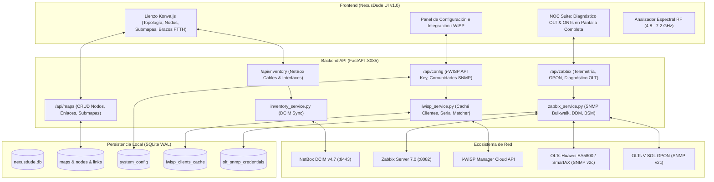

# 📡 NexusDude v1.0.0 — (Release NEXUSDUDE.1.0)
> **The Modern Network Dude for Nexus, Zabbix, NetBox & i-WISP**

Plataforma de mapeo, análisis y monitoreo visual de topologías de red en tiempo real estilo *The Dude*, integrada bidireccionalmente con **NetBox (DCIM/IPAM)**, **Zabbix 7.0 (Telemetría, LLD & BSM)**, **i-WISP Manager API** y **OLTs GPON/FTTH (Huawei SmartAX/EA5800 y V-SOL)**.


---

## 🚀 Características Principales

### 1. 🗺️ Lienzo Topológico Interactivo (Estilo The Dude Moderno)
- **HTML5 Canvas de Alto Rendimiento:** Basado en **Konva.js** con soporte para miles de elementos, zoom infinito, paneo suave y cuadrícula magnética (*Snap to Grid* de 20px).
- **Jerarquía Multinivel y Submapas:** Navegación fluida entre mapas raíz, submapas locales, accesos directos (*parent shortcuts*) y bornes virtuales de interconexión con cálculo automático de coordenadas y enrutamiento ortogonal sin colisiones.
- **Iconografía y Estados Dinámicos:** Detección de tipos de dispositivos (Switches, Routers, APs Cambium ePMP, CPEs, OLTs Huawei/V-SOL, Servidores) con indicadores visuales de estado operativo en vivo (PING ICMP y SNMP).
- **Toolbar Limpia con Menú Desplegable:** Reorganización ergonómica que agrupa sincronizaciones en el menú `[🔄 Sincronización ▼]` (NetBox, Zabbix BSM, i-WISP) liberando espacio visual.

### 2. ⚡ Centro de Diagnóstico Profundo OLT & Clientes FTTH (NOC Suite)
- **Acceso Rápido:** Botón destacado `[⚡ Diagnóstico OLT]` en la barra superior o contextual desde cualquier nodo de Brazo FTTH en el lienzo.
- **Descubrimiento Multi-OLT:** Detecta automáticamente las **24 OLTs** registradas en Zabbix (`/api/zabbix/olt/diagnostic-summary`).
- **Carrusel Interactivo de Puertos GPON:** Selector horizontal de tarjetas con conteo de ONTs por puerto (`GPON 0/1/0` a `GPON 0/1/15`).
- **Lectura SNMP Secuencial en Vivo:** Ejecuta walks optimizados (`snmpbulkwalk -Cr10 -t 3 -r 2`, evitando saturación de la controladora Huawei):
  - Serial de la ONT (`.43.1.3` / `hwGponOntSerialNumber`).
  - Descripción y Nombre (`.43.1.9` / `hwGponOntDescr`).
  - Potencia Óptica Rx en dBm (`.51.1.4` / `hwGponOntOpticalInfoRxPower`).
  - Causa Raíz de Desconexión (`.46.1.15` / `hwGponOntLastDownCause`).
- **Diagnóstico Inteligente de Fallas:**
  - ⚡ **Dying-Gasp (Código 1):** Identifica corte de energía eléctrica en el domicilio del cliente (fibra óptica íntegra).
  - ✂️ **Corte de Fibra / LOSi (Código 2):** Identifica corte físico de cable, fibra doblada o caída de caja NAP.
  - 🟡 **Atenuación Óptica:** Identifica ONUs con señal crítica ($\le -27.0\text{ dBm}$) y óptima ($> -24.0\text{ dBm}$).
- **Enriquecimiento con i-WISP:** Muestra N° de Cliente (`#10089`), Nombre Completo y Plan Contratado con Costo (`RESIDENCIAL 50M ($450)`).
- **7 Tarjetas de KPIs en Vivo:** Total ONTs, En Línea, Óptimas, Atenuadas, Sin Luz (Dying-Gasp), Cortes Fibra (LOSi), Enlace i-WISP.
- **Buscador Reactivo y Filtros Rápidos:** Filtrado instantáneo por texto, N° de ID, serial o causas con contadores numéricos.

### 3. 🔑 Seguridad y Gestión Multi-Comunidad SNMP para OLTs
- **Problemática Resuelta:** En entornos reales de ISP, las OLTs no comparten una sola comunidad SNMP por políticas de seguridad de cada celda.
- **Tabla de Credenciales Dedicada (`olt_snmp_credentials`):** Guarda la comunidad real verificada por IP de OLT independiente de Zabbix.
- **Smart Fallback Automático:** Si una comunidad no responde, prueba en cascada el diccionario de candidatos (`Muci!6508_rd`, `Mucivaga6508_rd`, `admin6508`, `public`) y auto-aprende la que responda.
- **Edición en Caliente en UI:** Campo editable `[ 🔑 SNMP: | ... | ] [ Aplicar ]` en el modal de diagnóstico para probar y guardar nuevas comunidades en tiempo real.

### 4. 🛰️ Integración con i-WISP Manager API
- **Almacenamiento Seguro (`system_config`):** Persistencia de `iwisp_api_key` y `iwisp_api_url` en base de datos local sin reiniciar contenedores.
- **Modal de Configuración (`#modal-settings`):** Entrada de API Key con visualizador de contraseña, prueba de conexión en vivo (`/getLocalities`) y contador de registros sincronizados.
- **Caché Local de Alta Velocidad (`iwisp_clients_cache`):** Indexación optimizada sobre `onu_serial`, `client_id` y `client_name` con búsquedas sub-milisegundo (<0.5ms).
- **Normalizador de Seriales:** Convierte automáticamente entre formatos Hex-STRING (`48 57 54 43...`) y ASCII (`HWTC...`).

### 5. 🌐 Brazos FTTH en el Lienzo (`ftth_branch`)
- **Objeto Especializado de Ramal GPON:** Representa puertos GPON vinculados a OLTs en el mapa.
- **Semáforo Inteligente:** Verde (Óptimo), Amarillo (Alerta Óptica), Rojo (Puerto Caído).
- **Telemetría en Vivo:** Tráfico instantáneo (`Mbps In / Out`), volumen mensual (`GB / TB`), conteo de ONUs típicas y atípicas.
- **Enlace Contextual:** Botón directo `[⚡ Abrir Diagnóstico OLT]` desde las propiedades del nodo para abrir la OLT y puerto correspondiente.

### 6. 🔌 Cableado Físico Bidireccional con NetBox (`dcim_cable`)
- **Matriz de Puertos Reales:** Renderizado de puertos por modelo de equipo (`GE1-GE24`, `SFP25-SFP28`, `eth0`).
- **Aprovisionamiento Automático:** Creación automática de interfaces en NetBox si no están declaradas.
- **Sincronización de Cables:** Alta y baja de cables físicos en NetBox al conectar o eliminar aristas en el lienzo.

### 7. 📊 Analizador de Espectro RF (4850 - 7250 MHz)
- **Regla Gráfica de Frecuencias:** Visualización interactiva con anchos de canal (20, 40, 80, 160 MHz) para bandas 5 GHz, UNII-4 y Wi-Fi 6E (6 GHz).
- **Métricas Inalámbricas:** Integración de RSSI (dBm), SNR (dB) y modulación MCS en radioenlaces Cambium ePMP.

---

## 🏗️ Arquitectura del Sistema



---

## 🗄️ Esquema de Base de Datos (`data/nexusdude.db`)

| Tabla | Propósito | Índices / Claves |
|---|---|---|
| `maps` | Lienzos y mapas raíz / submapas | `PRIMARY KEY (id)` |
| `nodes` | Dispositivos, APs, switches, notas y brazos FTTH | `PRIMARY KEY (id)`, `FK (map_id)` |
| `links` | Aristas y conexiones lógicas/físicas | `PRIMARY KEY (id)`, `FK (map_id)` |
| `roles` / `user_roles` | RBAC granular (Admin, ServerAdmin, Operator, Viewer) | `PRIMARY KEY (id / username)` |
| `system_config` | Almacenamiento seguro de llaves de API y configuraciones | `PRIMARY KEY (key)` |
| `iwisp_clients_cache` | Caché local de clientes, ONTs y planes de i-WISP | `idx_iwisp_onu_serial`, `idx_iwisp_client_id`, `idx_iwisp_client_name` |
| `olt_snmp_credentials` | Comunidades SNMP por OLT y estado de verificación | `PRIMARY KEY (olt_ip)` |

---

## 📡 Referencia de API Endpoints

### Diagnóstico OLT & GPON (`/api/zabbix/olt`)
* `GET /api/zabbix/olt/diagnostic-summary`: Resumen global de OLTs, estado y credencial SNMP.
* `GET /api/zabbix/olt/{olt_ip}/gpon-ports`: Lista de puertos GPON de la OLT con métricas.
* `GET /api/zabbix/olt/{olt_ip}/port/{port_index}/onts-detailed`: Telemetría SNMP en vivo de ONTs con cruce de clientes i-WISP y análisis de fallas (Dying-Gasp / LOSi).
* `POST /api/zabbix/olt/{olt_ip}/community`: Prueba y guarda la comunidad SNMP de una OLT en caliente.

### Configuración i-WISP (`/api/config/iwisp`)
* `GET /api/config/iwisp`: Configuración actual con API Key enmascarada y estado.
* `POST /api/config/iwisp`: Guarda o actualiza la API Key y URL base.
* `POST /api/config/iwisp/test`: Valida en vivo la conexión con la API de i-WISP.
* `POST /api/config/iwisp/sync`: Sincroniza el catálogo de clientes y ONTs hacia la base local.
* `GET /api/config/iwisp/cache-status`: Retorna conteo de clientes, ONTs y última sincronización.

### Mapas, Nodos y Enlaces (`/api/maps`)
* `GET /api/maps`: Lista de mapas jerárquicos.
* `POST /api/maps`: Crear nuevo mapa o submapa.
* `GET /api/maps/{map_id}`: Carga completa de nodos, aristas y geometría.
* `POST /api/maps/nodes`: Crear dispositivo, nota adhesiva o brazo FTTH.
* `PUT /api/maps/nodes/{node_id}`: Actualizar posición, propiedades o telemetría.
* `POST /api/maps/links`: Conectar dos nodos con cableado físico NetBox.

---

## 🛠️ Comandos de Operación

### Iniciar el Servicio
```bash
docker compose up -d
```

### Reconstruir Contenedor con Nuevas Dependencias
```bash
docker compose up -d --build
```

### Consultar Logs en Vivo
```bash
docker compose logs -f nexusdude-web
```

### Verificación de Salud
```bash
curl http://localhost:8085/api/health
```

---

## 📋 Historial de Versiones (Changelog)

### Version 1.0.0 (Release NEXUSDUDE.1.0) — 2026-09-24
- **Centro de Diagnóstico Profundo OLT:** Suite NOC completa de pantalla completa con selector de 24 OLTs, carrusel de puertos GPON y tabla de telemetría SNMP en tiempo real.
- **Detección de Causa Raíz FTTH:** Identificación automática de fallas por corte eléctrico domiciliario (⚡ *Dying-Gasp*) vs corte físico de fibra óptica (✂️ *LOSi*).
- **Integración i-WISP Manager:** Base de datos local indexada para cruce automático de Serial de ONT con N° de Cliente, Nombre y Plan contratado.
- **Sistema Multi-Comunidad SNMP:** Gestión de credenciales por OLT, cascada inteligente de auto-aprendizaje y edición en caliente desde la interfaz.
- **Limpieza de Toolbar:** Menú desplegable interactivo `[🔄 Sincronización ▼]` para optimización del espacio de trabajo visual.
- **Batería de Pruebas Automatizadas:** Suite de validación doble ejecutada con 0 errores y 100% de casos de uso verificados.

---

**Desarrollado para:** Operaciones de Red, NOC e Ingeniería de Planta Externa.  
**Servidor Host:** `10.9.1.6:8085` | **Nexus Orchestrator:** `https://10.9.1.6:5001`
