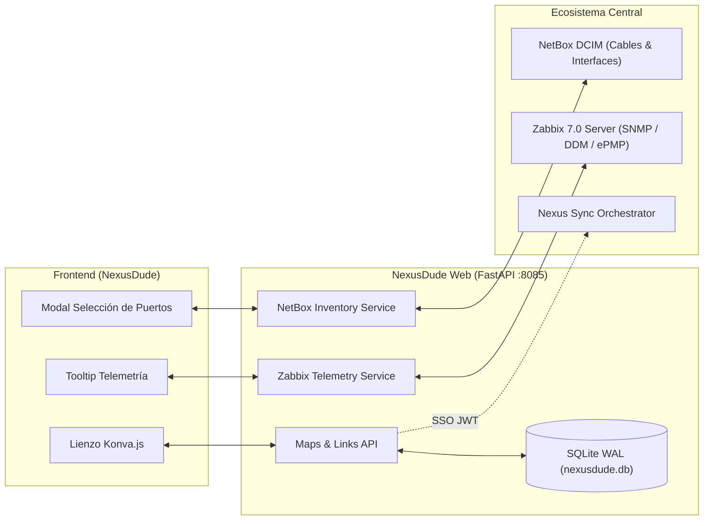

# 📡 NexusDude (The Modern Network Dude for Nexus, Zabbix & NetBox)

Plataforma de mapeo y monitoreo visual de topologías de red en tiempo real, integrada bidireccionalmente con **NetBox (DCIM/IPAM)** y **Zabbix (Telemetría & BSM)**.

---

## 🚀 Características Principales

### 1. 🗺️ Lienzo Topológico Interactivo (Estilo The Dude)
- **HTML5 Canvas de Alto Rendimiento:** Basado en **Konva.js** con soporte para miles de elementos, zoom infinito, paneo suave y cuadrícula magnética (*Snap to Grid*).
- **Jerarquía Multinivel y Submapas:** Navegación fluida entre mapas globales, submapas locales, accesos directos (*parent shortcuts*) y bornes virtuales de interconexión.
- **Iconografía y Estados Dinámicos:** Detección de tipos de dispositivos (Switches, Routers, APs Cambium, CPEs, OLTs, Servidores) con indicadores visuales de estado operativo en vivo.

### 2. 🔌 Integración Bidireccional de Cableado Físico con NetBox
- **Matriz Visual de Puertos Reales:** Renderizado interactivo de puertos físicos por modelo de equipo (ej. `GE1` a `GE24` + `SFP25` a `SFP28` en switches Planet SGS-6341, `eth0` en ePMP/CPEs, etc.).
- **Aprovisionamiento Automático de Interfaces:** Creación dinámica de plantillas de puertos en NetBox si el dispositivo no los tiene declarados.
- **Gestión de Cables (`dcim_cable`):** Creación y desvinculación automática de cables físicos en NetBox al conectar o eliminar aristas en el mapa.
- **Insignias Flotantes en el Canvas:** Identificación visual de los puertos conectados en cada extremo de la línea (ej. `[GE22]` ➔ `[eth0]`).

### 3. ⚡ Telemetría en Tiempo Real ("La Arista Cobra Vida")
- **Fuentes de Datos Zabbix Reutilizables:** Asignación de interfaces de Zabbix (`zabbix_src_interface`, `zabbix_tgt_interface`) como fuentes de telemetría sin restricción de exclusividad física.
- **Tooltip Dinámico en Hover:** Al posicionar el cursor sobre cualquier arista activa se despliega en tiempo real:
  - **Estado Operativo:** `UP` / `DOWN` y medio de transmisión (Cat6 Cobre, Fibra Monomodo/Multimodo, Enlace Inalámbrico).
  - **Tráfico de Red:** Tasas de transmisión y recepción en bits por segundo (`bps In` / `bps Out`).
  - **Diagnóstico Óptico DDM (Gibics SFP):** Potencias ópticas de recepción y transmisión en dBm ($P_{\text{rx}}$, $P_{\text{tx}}$).
  - **Métricas Inalámbricas (Cambium ePMP):** Nivel de señal RSSI (dBm), relación señal/ruido SNR (dB) y modulación MCS.

### 4. 🎛️ Conexiones Progresivas y Flexibles
- **Enlace Rápido / Sin Asignar:** Permite diagramar topologías lógicas de inmediato sin obligar a seleccionar puertos físicos ni fuentes de Zabbix en el momento.
- **Configuración Incremental:** Toda arista puede editarse posteriormente mediante doble clic para asignarle puertos de NetBox o métricas de Zabbix cuando se requiera documentar a detalle.

### 5. 🔐 Arquitectura y Seguridad
- **SSO Delegado con Nexus:** Autenticación fluida validando tokens JWT firmados por el *Nexus Sync Orchestrator*.
- **Persistencia Ultrarrápida:** Base de datos SQLite local optimizada con modo WAL (`data/nexusdude.db`).
- **Aislamiento No Bloqueante:** Consultas de telemetría a Zabbix en modo solo lectura (`item.get` / `history.get`) con caché y timeouts cortos que no saturan el servidor de monitoreo.

---

## 🏗️ Arquitectura de Integración



---

## 🛠️ Comandos de Operación

### Iniciar o Actualizar el Servicio
```bash
docker compose up -d --build
```

### Reiniciar el Contenedor
```bash
docker restart nexusdude-web
```

### Consultar Logs en Tiempo Real
```bash
docker logs -f nexusdude-web
```

### Verificación de Estado y Salud (Healthcheck)
```bash
curl http://localhost:8085/api/health
```

---

## 📂 Estructura del Proyecto

```text
nexusdude/
├── app/
│   ├── api/
│   │   ├── auth_routes.py        # Autenticación y validación SSO
│   │   ├── inventory_routes.py   # Endpoints de NetBox y puertos
│   │   ├── maps_routes.py        # CRUD de mapas, nodos y enlaces
│   │   └── zabbix_routes.py      # Telemetría de aristas y nodos
│   ├── services/
│   │   ├── inventory_service.py  # Sincronización y cables NetBox
│   │   └── zabbix_service.py     # Extracción SNMP, DDM y métricas
│   ├── static/
│   │   ├── index.html            # UI principal, modales y tooltips
│   │   ├── css/style.css         # Estilos visuales The Dude
│   │   └── js/
│   │       ├── api.js            # Cliente REST API
│   │       └── app.js            # Renderizado Konva, eventos y canvas
│   ├── database.py               # Esquema SQLite y migraciones
│   ├── models.py                 # Modelos Pydantic
│   └── main.py                   # Inicialización FastAPI
├── data/
│   └── nexusdude.db              # Base de datos SQLite (persistencia)
├── docker-compose.yml            # Orquestación de contenedores
└── README.md                     # Documentación técnica
```
