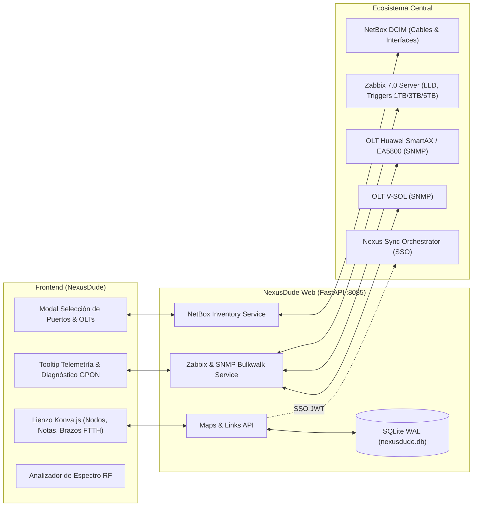

# 📡 NexusDude (The Modern Network Dude for Nexus, Zabbix & NetBox)

Plataforma de mapeo, análisis y monitoreo visual de topologías de red en tiempo real, integrada bidireccionalmente con **NetBox (DCIM/IPAM)**, **Zabbix 7.0 (Telemetría, LLD & BSM)** y **OLTs GPON/FTTH (Huawei SmartAX/EA5800 y V-SOL)**.

---

## 🚀 Características Principales

### 1. 🗺️ Lienzo Topológico Interactivo (Estilo The Dude Moderno)
- **HTML5 Canvas de Alto Rendimiento:** Basado en **Konva.js** con soporte para miles de elementos, zoom infinito, paneo suave y cuadrícula magnética (*Snap to Grid* de 20px).
- **Jerarquía Multinivel y Submapas:** Navegación fluida entre mapas raíz, submapas locales, accesos directos (*parent shortcuts*) y bornes virtuales de interconexión con cálculo automático de coordenadas y enrutamiento ortogonal sin colisiones.
- **Iconografía y Estados Dinámicos:** Detección de tipos de dispositivos (Switches, Routers, APs Cambium ePMP, CPEs, OLTs Huawei/V-SOL, Servidores) con indicadores visuales de estado operativo en vivo (PING ICMP y SNMP).

### 2. 📝 Nodos de Notas y Anotaciones Visuales
- **Sticky Notes Personalizables:** Nodos livianos para documentación en lienzo (ej. *Entronque Huizache*, recordatorios, etiquetas de zona, notas operativas).
- **Paleta de Colores Translúcidos:** Temas visuales en amarillo, azul, verde, púrpura, naranja y gris con bordes y tipografía responsive.

### 3. 🌐 Brazos FTTH y Monitoreo Óptico GPON en Tiempo Real (`ftth_branch`)
- **Objeto Especializado de Ramal FTTH:** Representa brazos y puertos GPON vinculados a OLTs (ej. OLT Huizache `10.20.0.2`, puerto `GPON 0/1/0` / ifIndex `4194312192`).
- **Estados y Colores Inteligentes en Vivo:**
  - 🟢 **Verde (`#10b981`)**: Puerto GPON Operativo (`Link Up`) y niveles de señal dentro del rango normal ($> -27\text{ dBm}$).
  - 🟡 **Amarillo (`#f59e0b`)**: Alerta por clientes ópticos atípicos / deficientes ($\le -27\text{ dBm}$).
  - 🔴 **Rojo (`#ef4444`)**: Puerto GPON caído (`Link Down` / SNMP `ifOperStatus = 2`).
- **Telemetría Flotante y Diagnóstico de ONUs (Bajo Demanda)**:
  - **Tráfico en Vivo:** Medición de ancho de banda entrante y saliente (`Mbps In` / `Mbps Out`).
  - **Volumen Acumulado:** Medición mensual en Megabytes, Gigabytes y Terabytes (`GB` / `TB`).
  - **Diagnóstico Óptico de Clientes:**
    - Conteo y promedio en dBm de **Clientes Típicos** ($> -27\text{ dBm}$).
    - Conteo y promedio en dBm de **Clientes Atípicos** ($\le -27\text{ dBm}$).
  - **Análisis de Causa Raíz de Caídas**:
    - ⚡ **Dying-Gasp**: Corte de energía eléctrica en el domicilio del cliente (fibra intacta).
    - ✂️ **LOSi / LOBi**: Corte físico de fibra óptica o atenuación extrema.

### 4. 🔌 Integración Bidireccional de Cableado Físico con NetBox
- **Matriz Visual de Puertos Reales:** Renderizado interactivo de puertos físicos por modelo de equipo (ej. `GE1` a `GE24` + `SFP25` a `SFP28` en switches Planet SGS-6341, `eth0` en ePMP/CPEs, etc.).
- **Aprovisionamiento Automático de Interfaces:** Creación dinámica de plantillas de puertos en NetBox si el dispositivo no los tiene declarados.
- **Gestión de Cables (`dcim_cable`):** Creación y desvinculación automática de cables físicos en NetBox al conectar o eliminar aristas en el mapa.
- **Insignias Flotantes Dinámicas:** Etiquetas orientadas sobre la línea con separación visual calculada (`offsetDist`) para evitar superposición con los bordes de los nodos.

### 5. ⚡ Telemetría de Aristas y Analizador Espectral RF
- **Fuentes de Datos Zabbix Reutilizables:** Asignación de interfaces de Zabbix (`zabbix_src_interface`, `zabbix_tgt_interface`) como fuentes de telemetría sin restricción de exclusividad física.
- **Diagnóstico Óptico DDM (Gibics SFP):** Potencias ópticas de recepción y transmisión en dBm ($P_{\text{rx}}$, $P_{\text{tx}}$).
- **Métricas Inalámbricas (Cambium ePMP):** Nivel de señal RSSI (dBm), relación señal/ruido SNR (dB) y modulación MCS.
- **Analizador Espectral RF (4850 - 7250 MHz):** Regla gráfica de espectro con anchos de canal para bandas 5 GHz, UNII-4 y Wi-Fi 6E (6 GHz).

### 6. 📊 Plantillas SNMP Zabbix 7.0 (Huawei SmartAX / EA5800 & V-SOL)
- **Descubrimiento LLD de ONUs de Alta Velocidad:** Lectura de tablas ligeras `.43.1.9` (Descripciones) y `.43.1.3` (Serial Number) con `snmpbulkwalk` que evita timeouts por OMCI.
- **Alertas y Triggers Automatizados:**
  - Disparo de advertencia por ONT atenuada ($\le -27\text{ dBm}$).
  - Triggers acumulados de consumo mensual de ancho de banda por interfaz/puerto al alcanzar **1 TB**, **3 TB** y **5 TB**.

### 7. 🔐 Arquitectura y Seguridad
- **SSO Delegado con Nexus:** Autenticación fluida validando tokens JWT firmados por el *Nexus Sync Orchestrator*.
- **Persistencia Ultrarrápida:** Base de datos SQLite local optimizada con modo WAL (`data/nexusdude.db`).
- **Caché No Bloqueante:** Consultas asíncronas con `asyncio` y caché en memoria de 10s en frontend (`_gponTelemetryCache`).

---

## 🏗️ Arquitectura de Integración



---

## 🛠️ Comandos de Operación

### Iniciar o Reconstruir el Servicio
```bash
docker compose up -d --build
```

### Reiniciar el Contenedor
```bash
docker compose restart nexusdude-web
```

### Consultar Logs en Tiempo Real
```bash
docker compose logs -f nexusdude-web
```

### Verificación de Estado y Salud (Healthcheck)
```bash
curl http://localhost:8085/api/health
```

---

## 📂 Estructura del Proyecto

```text
nexusdude/
├── app/
│   ├── api/
│   │   ├── auth_routes.py        # Autenticación y validación SSO
│   │   ├── inventory_routes.py   # Endpoints de NetBox y puertos
│   │   ├── maps_routes.py        # CRUD de mapas, nodos, notas y enlaces
│   │   └── zabbix_routes.py      # Telemetría de aristas, nodos y brazos FTTH
│   ├── services/
│   │   ├── inventory_service.py  # Sincronización y cables NetBox
│   │   └── zabbix_service.py     # Extracción SNMP Bulkwalk, DDM, GPON y métricas
│   ├── static/
│   │   ├── index.html            # UI principal, modales, notas y tooltips
│   │   ├── css/style.css         # Estilos visuales The Dude Moderno
│   │   └── js/
│   │       ├── api.js            # Cliente REST API autenticado
│   │       └── app.js            # Renderizado Konva, brazos FTTH, eventos y canvas
│   ├── database.py               # Esquema SQLite, migraciones y roles
│   ├── models.py                 # Modelos Pydantic
│   └── main.py                   # Inicialización FastAPI
├── data/
│   └── nexusdude.db              # Base de datos SQLite (persistencia)
├── Dockerfile                    # Definición de contenedor con curl, sqlite3 y snmp
├── docker-compose.yml            # Orquestación de contenedores
├── Template_Huawei_SmartAX_eKit_OLT_SNMP.yaml # Plantilla Zabbix 7.0 para OLT Huawei
└── README.md                     # Documentación técnica completa
```
